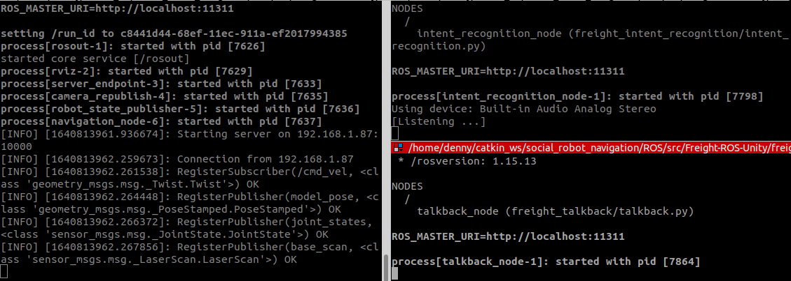
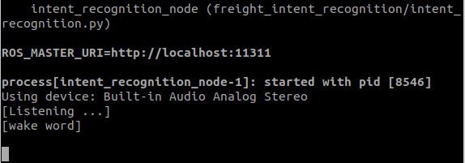

# Social Robot Navigation
This repository simulates a robot in unity simulation, which understands navigation intent from human speech and executes it.

PLEASE MAKE SURE YOU HAVE A STABLE INTERNET CONNECTION WHILE RUNNING THE SIMULATION.

## Contents
- Social Robot Navigation
  - [1. Introduction](#1-introduction)
  - [2. Setup](#2-setup)
  - [3. Run](#3-run)
    - [i. Setup Parameters](#i-setup-parameters)
    - [ii. Run Unity](#ii-run-unity)
    - [iii. Run Navigation](#iii-run-navigation)
    - [iv. Run Intent Recognition](#iv-run-intent-recognition)
    - [v. Run Talkback](#v-run-talkback)
  - [4. Output](#4-output)

## 1. Introduction
This repo contains the Unity simulation for hospital scenario provided by WPI HiRO Lab [Gopher-In-Unity-Simulation](https://github.com/hiro-wpi/Gopher-In-Unity-Simulation) and a freight social robot that can understand human speech and also talk back to humans. The robots main functionality is to understand human speech containing navigation commands, derive human intent from speech like go to which room, go to which person, etc and then execute the following command. More information about working and can be found [here](https://github.com/dennyboby/social_robot_navigation/tree/master/docs/document).

## 2. Setup
In order to setup the repo follow the instruction in [SETUP.md](https://github.com/dennyboby/social_robot_navigation/blob/master/SETUP.md).

## 3. Run
This section discusses the setup of parameters and running different launch files.

### i. Setup Parameters
This section discusses the basic parameters that needs to be configured and other parameters that can be configured for custom performance.
1. Freight Unity Endpoint Parameters:
  - In `catkin_ws/social_robot_navigation/ROS/src/Freight-ROS-Unity/freight_unity_endpoint/config/params.yaml` set the `ROS_IP` to the IP address of your ROS machine. Same as the one set in Unity `Robotics -> ROS Settings`.
2. Freight Intent Recognition Parameters:
  - In `catkin_ws/social_robot_navigation/ROS/src/Freight-ROS-Unity/freight_intent_recognition/config/params.yaml` set the `access_key` following the instructions in this [link](https://picovoice.ai/docs/quick-start/console-access-key/)
  - Rest all parameters need not be changed for default functionality but can be changed for custom performance.

### ii. Run Unity
This section discusses on how to run the Unity simulation.
1. If the Unity simulation is not running then run the simulation following the instructions in [setup](https://github.com/dennyboby/social_robot_navigation/blob/master/SETUP.md#3-unity-setup). Since the simulation is already setup you only follow the points 3, 6 and 7.
2. Click on the play button in the Unity simulation to start the simulation (If you click on the play button again then the simulation will stop).
3. Then you can click on `connect` button to connect to the ROS part of the simulation.

### iii. Run Navigation
This section discusses on how to run the freight navigation. In order to run navigation, open a new terminal and follow the instructions below.

    cd catkin_ws/social_robot_navigation/ROS
    source devel/setup.bash
    roslaunch freight_navigation navigation.launch

On running the launch file you will see the following output on terminal.

### iv. Run Intent Recognition
This section discusses on how to run the freight intent recognition. In order to run intent recognition, open a new terminal and follow the instructions below.

    cd catkin_ws/social_robot_navigation/ROS
    source devel/setup.bash
    roslaunch freight_intent_recognition intent.launch

### v. Run Talkback
This section discusses on how to run the freight talkback. In order to run talkback functionality, open a new terminal and follow the instructions below.

    cd catkin_ws/social_robot_navigation/ROS
    source devel/setup.bash
    roslaunch freight_talkback talkback.launch

## 4. Output
This section discusses the output of the simulation. Once the simulation is running, you can follow the instructions below.
1. When all the launch files are running you can see the following output on terminal.

    

2. In order to activate the recognition you need to say the wake word `Jarvis` before any command and following output can be seen in the intent recognition terminal.

    

3. Then you can say any of the following commands and other variations (Initially the robot is spawned in room 1 so commands instructing it to go to the same room won't work).

        Please guide me to cardiology lab.  # This makes the robot move to cardiology lab which is mapped to room 2.
        Go to room 3 then room 1  # This makes the robot first got to room 3 then room 1.
        Tell me a joke.  # Robot says a joke.
        What's the date?  # Robot says the current date.
        What's the time?  # Robot says the current time.

4. If it's a navigation based command the you will be able to see the robot moving in Unity simulation. If the command is conversation based then the computer speakers will speak back the necessary answer.