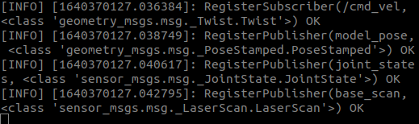

# Human Aware Robot Navigation
This repository simulates a Gopher robot in unity simulation, which autonomously navigates to a target location maintaining a social distance from people in its way.

PLEASE MAKE SURE YOU HAVE A STABLE INTERNET CONNECTION WHILE RUNNING THE SIMULATION.

## Contents
- Human Aware Robot Navigation
  - [1. Introduction](#1-introduction)
  - [2. Setup](#2-setup)
  - [3. Run](#3-run)
    - [i. Setup Parameters](#i-setup-parameters)
    - [ii. Run Unity](#ii-run-unity)
    - [iii. Run Navigation](#iii-run-navigation)
  - [4. Output](#4-output)

## 1. Introduction
This repo contains the Unity simulation for hospital scenario provided by WPI HiRO Lab [Gopher-In-Unity-Simulation](https://github.com/hiro-wpi/Gopher-In-Unity-Simulation) and a gopher social robot that can navigate using the social navigation cues. The robot predicts the future positions of the moving human and generates a social costmap around those predictions. The global planner plans a path considering all the costs. More information about working and can be found [here](https://github.com/dennyboby/human_aware_robot_navigation/tree/master/docs/document). #TODO: Add presentation and report to the documents folder.

## 2. Setup
In order to setup the repo follow the instruction in [SETUP.md](https://github.com/dennyboby/human_aware_robot_navigation/blob/master/SETUP.md).

## 3. Run
This section discusses the setup of parameters and running different launch files.

### i. Setup Parameters
This section discusses the basic parameters that needs to be configured and other parameters that can be configured for custom performance.
1. Gopher Unity Endpoint Parameters:
  - In `catkin_ws/human_aware_robot_navigation/ROS/src/Gopher-ROS-Unity/gopher_unity_endpoint/launch/gopher_presence_server.launch` set the `tcp_ip` to the IP address of your ROS machine. Same as the one set in Unity `Hospital -> TCPROSConnection`.
2. Gopher Navigation Parameters:
  - In `catkin_ws/human_aware_robot_navigation/ROS/src/Gopher-ROS-Unity/gopher_navigation/config` all navigation parameters can be found.
  - All navigation parameters need not be changed for default functionality but can be changed for custom performance.

### ii. Run Unity
This section discusses on how to run the Unity simulation.
1. If the Unity simulation is not running then run the simulation following the instructions in [setup](https://github.com/dennyboby/human_aware_robot_navigation/blob/master/SETUP.md#3-unity-setup). Since the simulation is already setup you only follow the points 3, 6 and 7.
2. Click on the play button in the Unity simulation to start the simulation (If you click on the play button again then the simulation will stop).
3. Then you can click on `connect` button to connect to the ROS part of the simulation.

### iii. Run Navigation
This section discusses on how to run the gopher navigation. In order to run navigation, open a new terminal and follow the instructions below.

    cd catkin_ws/human_aware_robot_navigation/ROS
    source devel/setup.bash
    roslaunch gopher_unity_endpoint gopher_presence_server.launch

On running the launch file you will see the following output on screen.

## 4. Output
This section discusses the output of the simulation. Once the simulation is running, you can follow the instructions below.
1. When all the launch files are running, go to RViz and click on `2D Nav Goal` and then give a navigation goal anywhere on the map shown in RViz. You will be able see the robot moving towards the goal avoiding the human as shown in the image below.

    

