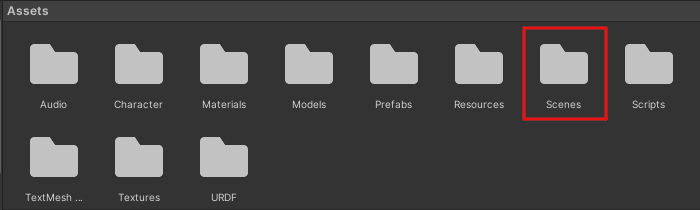
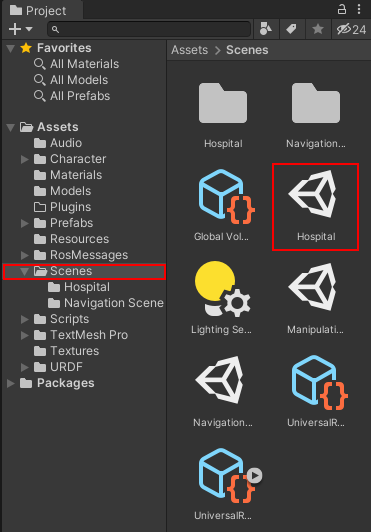
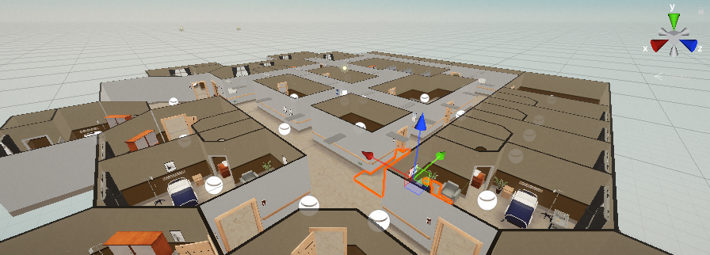

# Setup The Repository
This file explains how to setup the entire repository.

## Contents
- Setup The Repository
  - [1. Requirements](#1-requirements)
  - [2. Repository Setup](#2-repository-setup)
  - [3. Unity Setup](#3-unity-setup)
  - [4. ROS Setup](#4-ros-setup)
  - [5. PicoVoice Setup](#5-picovoice-setup)

## 1. Requirements
This repo was tested on Ubuntu 20.04 with ROS noetic so it requires prior installation of [ROS noetic](http://wiki.ros.org/noetic/Installation/Ubuntu) and [Unity Hub](https://unity.com/download).

## 2. Repository Setup
In-order to setup the repository locally on your system, open a new terminal and follow the instructions below

    mkdir catkin_ws
    cd catkin_ws
    git clone https://github.com/dennyboby/social_robot_navigation.git

## 3. Unity Setup
To setup Unity open Unity Hub and follow the instructions below:
1. Go to the `Installs` tab in Unity Hub, and click the `Add` button. Select Unity `2021.1.17f1`. If this version is no longer available through the hub, you can find it in the Unity Download Archive.
2. Go to the `Projects` tab in the Unity Hub, click the `Add` button, and navigate to and select the `Gopher-In-Unity-Simulation` directory within this cloned repository `(/PATH/TO/catkin_ws/social_robot_navigation/Unity/Projects/Gopher-In-Unity-Simulation)` to add the project to your Hub.
3. Click the newly added project to open it.
4. After launching the project, please navigate to the `Scenes` folder and open the `Hospital` scene.

    

    

5. You can toggle the visibility of the ceiling in the game object hierarchy.

    

6. Next, the ROS TCP connection needs to be created. Select `Robotics -> ROS Settings` from the top menu bar. In the ROS Settings window, the ROS IP Address should be the IP address of your ROS machine (not the one running Unity). Find the IP address of your ROS machine. In Ubuntu, open a terminal window, and enter `hostname -I`.

    

7. Finally the simulation will look like the image shown below.

    

## 4. ROS Setup
To setup the ROS part of the repository open a new terminal and follow the instructions below.

    cd catkin_ws/social_robot_navigation/ROS
    sudo apt-get install ros-noetic-catkin python3-catkin-tools
    catkin init
    catkin build
    source devel/setup.bash

Make sure that every new terminal running ROS components is sourced to avoid unable to find package issue.
In order to symlink python to the python3 version, open a new terminal and follow the instructions below ([link](https://packages.debian.org/sid/main/python-is-python3)).

    sudo apt install python-is-python3

Install the libraries required for the ROS part of the repository.

    cd ..
    pip install -r requirements.txt

## 5. PicoVoice Setup
TODO: Add instruction
